# Commercial vertical and brands LLM notebook

## Goal

After [intent_classification_llm.ipynb](../intent_classification_llm.ipynb) has produced labelled categories/subcategories, run a **single pass** on the **commercial** category only to:

1. Add **commercial vertical** labels (new column(s)) via LLM — same style as [commercial_vertical_extraction.ipynb](../commercial_vertical_extraction.ipynb) but **LLM-only** (no IAB/embedding/rule), and **no intent re-classification**.
2. Extract **commercial brand names** mentioned in the conversation, with a label for each brand: **query_only**, **answer_only**, or **both** (based on whether the brand appears only in user messages, only in assistant messages, or in both).
3. Use **all queries and all answers** per conversation (same as the reference notebook).
4. Output **concise, structured** LLM responses (single JSON per row) for efficiency.
5. Save the dataset to **parquet**.
6. Support **index range** (e.g. 0–10000): load from the corresponding folder under `intent_output`; **by default** load everything from `intent_output` with **no duplication** (infer from folder names, e.g. `0_10000`, `10000_20000`).
7. Use **parallel LLM** with **max_workers=100**, **batch_size=100** by default.
8. Add a **progress bar** for the main (most expensive) LLM call loop.

---

## Data flow

```mermaid
flowchart LR
  subgraph load [Load]
    IO[intent_output]
    Range[Range folders or single]
    LoadCat[Load commercial only]
  end
  subgraph prep [Prepare]
    Parse[ensure_conversation_parsed]
    Norm[ensure_conversation_normalized]
    AllQA[add_all_queries_answers_columns]
  end
  subgraph llm [LLM]
    Batch[Batched parallel calls]
    Cache[Cache by conversation_id]
    Bar[Progress bar on batch loop]
  end
  subgraph out [Output]
    Cols[vertical_tier1_llm, vertical_tier2_llm, brands]
    Parquet[Save parquet]
  end
  IO --> Range
  Range --> LoadCat
  LoadCat --> Parse --> Norm --> AllQA --> Batch
  Batch --> Bar --> Cache
  Cache --> Cols --> Parquet
```

---

## 1. Loading from intent_output (no duplication)

**Convention** (from [intent_classification_llm.ipynb](../intent_classification_llm.ipynb)):

- Output is under `intent_output/<range_label>/` where `range_label` is either `"all"` or `"{START_INDEX}_{END_INDEX}"` (e.g. `0_10000`).
- Per-category files: `by_major/commercial_investigation.parquet` (and similarly for other majors).

**Required behavior:**

- **When index range is specified** (e.g. `START_INDEX=0`, `END_INDEX=10000`): load from a single folder `intent_output/0_10000/by_major/commercial_investigation.parquet`. If that folder/file is missing, raise a clear error.
- **When no range is specified (default)**: load "everything" with no duplication:
  - Discover subdirs of `intent_output` whose names match `\d+_\d+` (e.g. `0_10000`, `10000_20000`). Sort by the numeric pair.
  - From each such folder, load `by_major/commercial_investigation.parquet` and concatenate. Ranges are disjoint by construction, so no deduplication needed.
  - Optionally: if `intent_output/all/by_major/commercial_investigation.parquet` exists and no range is given, use that single file instead of scanning `N_M` folders (document the choice; e.g. prefer `all` if present, else concat all `N_M`).

**Implementation:** Add a helper (e.g. in [intent_taxonomy.py](../intent_taxonomy.py) or [commercial_vertical_utils.py](../commercial_vertical_utils.py)) such as:

- `load_commercial_from_intent_output(intent_output_dir, category="commercial_investigation", start_index=None, end_index=None) -> pd.DataFrame`
- If both `start_index` and `end_index` are not None: load `intent_output_dir / f"{start_index}_{end_index}" / "by_major" / f"{category}.parquet"`.
- Else: list subdirs matching `^\d+_\d+$`, sort by (start, end), load each `by_major/commercial_investigation.parquet` and `pd.concat(..., ignore_index=True)`. If `intent_output_dir / "all" / "by_major" / ...` exists, can use that alone for "default" to avoid scanning.

---

## 2. New LLM function (vertical + brands, no intent)

**Location:** [commercial_vertical_utils.py](../commercial_vertical_utils.py).

**Single-call signature:** e.g. `_label_one_vertical_brands(client, all_queries, all_answers, max_combined_len=6000) -> dict`.

**Returned keys:**

- `vertical_tier1_llm`, `vertical_tier2_llm`: same vertical list as existing (e.g. `VERTICAL_LLM_LABELS`).
- `brands`: list of `{"name": "<brand>", "where": "query_only"|"answer_only"|"both"}`. Empty list if none.
- `rate_limit_hit`: bool (for retries).

**Prompt (concise, structured):**

- Input: full conversation text (truncated) from `all_queries` + `all_answers`.
- Instructions: output **only** a JSON object with keys `vertical_tier1`, `vertical_tier2`, `brands`. For `brands`, list commercial/product brand names mentioned and for each set `where` to `query_only`, `answer_only`, or `both` depending on where the brand appears (user messages only, assistant only, or both). No intent re-classification; no extra text.
- Reuse existing `_truncate`, `_call_chat`, and rate-limit/retry logic from [commercial_vertical_utils.py](../commercial_vertical_utils.py) (e.g. `_is_rate_limit_error`, 3 attempts with backoff).

**Parallel + cache + progress:**

- New function: e.g. `label_vertical_brands_llm_parallel(df, queries_col="all_queries", answers_col="all_answers", id_col="conversation_id", cache_path=..., use_cache=True, batch_size=100, max_workers=100, show_progress=True)`.
- Reuse pattern from `label_vertical_intent_llm_parallel`: merge cached labels by `conversation_id`, then for missing rows run batched `ThreadPoolExecutor` calls. **Add `tqdm` on the batch loop** (over `range(0, len(queries_list), batch_size)`) when `show_progress=True` so the expensive LLM pass shows progress.
- Cache parquet: same pattern as existing (e.g. `load_label_cache`, `merge_cached_labels`, `save_label_cache` from [insights_utils.py](../insights_utils.py)). Store `brands` as JSON string in parquet (list of dicts → `json.dumps` when saving, parse when loading so that `merge_cached_labels` and downstream get a list of dicts or consistent type).

---

## 3. Notebook structure

**New file:** e.g. `commercial_vertical_brands_llm.ipynb`.

**Control variables (top cell):**

- `INTENT_OUTPUT_DIR = "intent_output"`
- `CATEGORY_FILTER = "commercial_investigation"` (fixed for this notebook; filter = load only this category).
- `PROCESS_ALL = True` (default) or `False`; if `False`: `START_INDEX = 0`, `END_INDEX = 10000` (load from that range folder only).
- `LLM_BATCH_SIZE = 100`, `LLM_MAX_WORKERS = 100`
- `USE_CACHE = True`, `CACHE_PATH` (e.g. `intent_output/commercial_vertical_brands_llm.parquet` or under range folder)
- `SHOW_PROGRESS = True`
- Output path for final dataset (e.g. under `intent_output` or `intent_output/<range>/`): e.g. `OUTPUT_PARQUET = "intent_output/commercial_vertical_brands.parquet"` or per-range `intent_output/0_10000/commercial_vertical_brands_0_10000.parquet`

**Cells:**

1. **Load commercial data:** Call the new loader (range or all); then `ensure_conversation_parsed`, `ensure_conversation_normalized`, `add_all_queries_answers_columns` (from [commercial_vertical_utils.py](../commercial_vertical_utils.py) / [intent_analysis_utils.py](../intent_analysis_utils.py)).
2. **Run LLM:** Call `label_vertical_brands_llm_parallel(..., show_progress=SHOW_PROGRESS)`.
3. **Inspect:** Show value counts for `vertical_tier1_llm`, sample of `brands` (and optional split columns for query_only/answer_only/both for spot-check).
4. **Save:** Write the dataframe (all original columns + `vertical_tier1_llm`, `vertical_tier2_llm`, `brands`) to the chosen parquet path(s). If processing by range, save under `intent_output/{START_INDEX}_{END_INDEX}/`; if "all", save to a single path or under `intent_output/all/`.

Per-workspace convention: **logic in `.py`**, notebook thin (import + control vars + call functions).

---

## 4. Output schema and parquet

- **New columns:** `vertical_tier1_llm`, `vertical_tier2_llm`, `brands`.
- `brands`: stored as **JSON string** in parquet (e.g. `'[{"name":"Nike","where":"both"},...]'`) for compatibility; notebook or utils can parse to list of dicts for display/analysis. Optionally add derived columns `brands_query_only`, `brands_answer_only`, `brands_both` (lists of names) in the notebook for convenience; these can be computed from `brands` and not necessarily stored if you want to keep a single source of truth.
- Dataset saved to parquet as specified in the control vars (single file or per-range file).

---

## 5. Files to add/change

- **New notebook:** Create `commercial_vertical_brands_llm.ipynb` with control vars, load (range or all), prepare, LLM call, inspect, save.
- **[intent_taxonomy.py](../intent_taxonomy.py) or [commercial_vertical_utils.py](../commercial_vertical_utils.py):** Add `load_commercial_from_intent_output(..., start_index=None, end_index=None)` that loads by range folder or all range folders (no duplication).
- **[commercial_vertical_utils.py](../commercial_vertical_utils.py):** Add `_label_one_vertical_brands` (single-call, vertical + brands, structured JSON only) and `label_vertical_brands_llm_parallel` (batched, cached, progress bar via tqdm on batch loop).
- **[insights_utils.py](../insights_utils.py):** Ensure `load_label_cache` can handle a `brands` column that is JSON string (already has logic for `brands` in `load_label_cache`); confirm merge/save handle list-of-dicts → JSON string for parquet.

---

## 6. Edge cases

- **Missing folder:** If range `0_10000` is requested but `intent_output/0_10000/` does not exist, raise with a clear message.
- **Empty commercial set:** If after loading there are 0 rows, skip LLM and optionally write an empty parquet or exit gracefully.
- **Cache key:** Cache by `conversation_id`; cache path can be global or per-range (e.g. `intent_output/commercial_vertical_brands_llm.parquet` for a single shared cache, or per-range cache under `intent_output/0_10000/`). Single shared cache is simpler and supports "load all" without re-calling LLM for already-processed IDs.

---

## Summary

- **New notebook** filters to commercial, loads from intent_output (single range or all ranges, no duplication), adds `all_queries`/`all_answers`, runs **one** LLM pass (vertical + brands with query_only/answer_only/both), saves to parquet; **progress bar** on the main LLM loop; **parallel** default 100/100; **concise structured** JSON output; logic in **commercial_vertical_utils** (and optionally intent_taxonomy for the loader).
