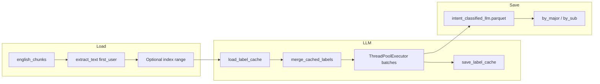

# LLM-based intent classification notebook

## Goal

A **new notebook** that redoes intent classification using the LLM-based approach from [commercial_vertical_extraction.ipynb](../commercial_vertical_extraction.ipynb): same parallel batching, caching, and structured JSON output, but **intent-only** (no vertical extraction). Taxonomy (categories and sub-categories) must match [intent_classification.ipynb](../intent_classification.ipynb) / [intent_taxonomy.py](../intent_taxonomy.py). Data from `english_chunks`; no sampling; optional index range; save parquets with original columns plus new label columns; include a spot-check cell.

## Taxonomy to follow (from intent_taxonomy.py)

- **Categories (major):** `informational`, `navigational`, `commercial_investigation`, `transactional`
- **Sub-categories:**  
  - informational → `coding`, `creative_writing`, `education`, `support`, `casual_other`  
  - navigational → `navigational`  
  - commercial_investigation → `commercial_product`  
  - transactional → `transactional`

Output columns will be **intent_major** and **intent_sub** so existing [intent_taxonomy.save_classified_by_category](../intent_taxonomy.py) and `load_category` work unchanged.

## 1. Extend commercial_vertical_utils.py

**Location:** [commercial_vertical_utils.py](../commercial_vertical_utils.py)

- **Subcategory guidelines:** Add `INTENT_SUBCATEGORY_GUIDELINES` (or extend `INTENT_GUIDELINES`) so the LLM gets explicit sub-category definitions aligned with [intent_taxonomy.py](../intent_taxonomy.py) (e.g. coding vs creative_writing vs education vs support vs casual_other; and single-option majors: navigational, commercial_product, transactional). Reuse the same style as existing `INTENT_GUIDELINES` (short, bullet-style).
- **New function:** `label_intent_llm_parallel(...)` (intent-only, no vertical):
  - **Inputs:** `df`, `text_col="text"` (query = first user message), `id_col="conversation_id"`, `cache_path` (e.g. `intent_output/intent_llm.parquet`), `use_cache=True`, `batch_size=150`, `max_workers=150`.
  - **Behavior:** Same pattern as `label_vertical_intent_llm_parallel`: `load_label_cache` → `merge_cached_labels` → for missing rows call LLM in parallel (ThreadPoolExecutor) in batches, `save_label_cache` after each batch, 0.2s sleep between batches, rate-limit detection and retry/backoff.
  - **LLM prompt:** One call per row using **query text only** (no all_queries/all_answers). Ask for a single JSON with exactly: `intent_major` (one of the 4 categories), `intent_sub` (one of the valid sub-categories for that major). Use `INTENT_GUIDELINES` + subcategory guidelines; instruct model to reply with **only** the JSON object for efficiency.
  - **Output:** Add columns `intent_major` and `intent_sub` to a copy of `df` and return it (only rows that were in the input `df` get labels; cache is keyed by `id_col`).
  - **Validation:** If LLM returns an invalid category, map to `informational`; if invalid sub given major, map to the correct fallback (e.g. `casual_other` for informational, or the single option for navigational/transactional/commercial_product).

No change to existing `label_vertical_intent_llm_parallel` or vertical logic.

## 2. New notebook: intent_classification_llm.ipynb

**Structure (control variables at top, then minimal cells that call into .py):**

- **Control cell (run first)**  
  - `ENGLISH_CHUNKS_DIR = "data/english_chunks"`  
  - `INTENT_OUTPUT_DIR = "intent_output"`  
  - `PROCESS_ALL = True`  # if False, use index range below  
  - `START_INDEX = 0`  
  - `END_INDEX = 10000`  # used only when PROCESS_ALL is False  
  - `SAVE_BY_CATEGORY = True`  
  - `INTENT_LLM_CACHE_PATH = "intent_output/intent_llm.parquet"`  
  - `LLM_BATCH_SIZE = 150`  
  - `LLM_MAX_WORKERS = 150`
- **Load data**  
  - Load from `english_chunks` via `load_english_chunked_parquet` (from [eda_utils](../eda_utils.py)).  
  - **No sampling:** add query text (first user message) for all rows: use `extract_text_column(..., mode="first_user")` and drop rows with empty `text` (same as intent_classification.ipynb but without `prepare_sample` so order is preserved and no sampling).  
  - Apply index range when not process all: `df_to_process = df if PROCESS_ALL else df.iloc[START_INDEX:END_INDEX].copy()`.
- **Run LLM intent classification**  
  - Call `label_intent_llm_parallel` from `commercial_vertical_utils` with `df_to_process`, `text_col="text"`, cache path, `batch_size=LLM_BATCH_SIZE`, `max_workers=LLM_MAX_WORKERS`.  
  - Result: same dataframe with all original columns plus `intent_major` and `intent_sub`.
- **Save parquets**  
  - Ensure output dir exists.  
  - Save the **processed** table (all original columns + `intent_major` + `intent_sub`) to e.g. `INTENT_OUTPUT_DIR/intent_classified_llm.parquet` (or a name that can reflect index range when not PROCESS_ALL, e.g. `intent_classified_llm_{start}_{end}.parquet`).  
  - If `SAVE_BY_CATEGORY`: call `save_classified_by_category(df_result, INTENT_OUTPUT_DIR, full_name="intent_classified_llm.parquet")` so by_major and by_sub are also written (reuse [intent_taxonomy.save_classified_by_category](../intent_taxonomy.py)).
- **Spot-check intent category**  
  - One cell that helps spot-check: e.g. sample N rows per `intent_major` (or show a random sample with `text`, `intent_major`, `intent_sub`), so the user can visually verify labels. Prefer sampling a few per category (e.g. 5–10) and displaying query text + labels in a clear table or list.

## 3. Data flow summary

## 4. Files to touch

| File | Action |
| ------------------------------------------------------------ | --------------------------------------------------------------------------------------------------------------------------------------------------------------- |
| [commercial_vertical_utils.py](../commercial_vertical_utils.py) | Add subcategory guidelines; add `label_intent_llm_parallel()` |
| (new) intent_classification_llm.ipynb | New notebook: controls, load from english_chunks (no sample, index range), call LLM util, save with original columns + intent_major/intent_sub, spot-check cell |

## 5. Design notes

- **Query-only:** LLM sees only the first user message (`text`), matching the rule-based intent_classification.ipynb.  
- **Original columns preserved:** The dataframe passed to the LLM and saved is the same slice/full df from english_chunks with only `text` added and `intent_major` / `intent_sub` added; no columns dropped.  
- **Cache:** Keyed by `conversation_id`; re-runs skip already-labeled rows; index-range runs can be repeated for different ranges and merged offline, or run "process all" once.  
- **Naming:** Using `intent_major` and `intent_sub` keeps compatibility with `save_classified_by_category` and downstream notebooks (e.g. commercial_vertical_extraction, intent_spotcheck_and_trends) that expect those column names.
