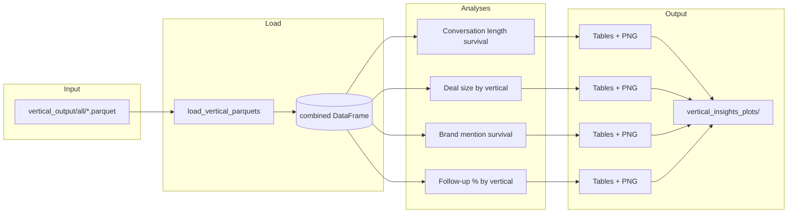

# Vertical Insights Notebook Plan

## Data source and schema

- **Location**: [vertical_output/all](../vertical_output/all). Parquet files are produced by [commercial_vertical_brands_llm.ipynb](../commercial_vertical_brands_llm.ipynb); naming pattern: `commercial_vertical_brands_{category_label}_{RANGE_LABEL}.parquet` (e.g. `commercial_vertical_brands_commercial_investigation_all.parquet`). You run the pipeline per category (e.g. commercial_investigation, transactional, or subcategory education), so `vertical_output/all` may contain one or more such files.
- **Key columns** (from [brand_metrics_and_deal_size.md](brand_metrics_and_deal_size.md) and the notebook):
  - **Category/vertical**: `intent_major`, `intent_sub`, `vertical_tier1_llm`, `vertical_tier2_llm`
  - **Conversation length**: `n_messages` (from brand dynamics step)
  - **Deal size**: `deal_size_usd`, `product_mentioned`, `product_inferred`
  - **Brand dynamics**: `brands_enriched` (JSON list of dicts with `mention_span`, `user_follow_up`, `first_mention_round`, etc.), and per-conversation summary: `any_user_follow_up_on_brand`, `total_brands`, `first_brand_first_round`, etc.
- **Loading**: Discover all `*.parquet` in `vertical_output/all`; read each and attach a **category** column (from filename: e.g. extract `commercial_investigation` from `commercial_vertical_brands_commercial_investigation_all.parquet`, or use `intent_major`/`intent_sub` if a single file). Parse `brands` and `brands_enriched` from JSON strings when present. Concatenate into one DataFrame for analysis.

---

## 1. Survival analysis: conversation length

- **Metric**: `n_messages` (conversation length). If missing, compute from `conversation` column length.
- **Across categories** (commercial, transactional, education):
  - **Plot**: Survival curve — for each message index `t`, fraction of conversations with `n_messages >= t`. One curve per category (commercial, transactional, education). Use matplotlib/seaborn (no lifelines in project); implement as 1 - CDF or step plot of empirical survival.
  - **Table**: Per category: count, mean, median, percentiles (e.g. 25, 75, 90) of `n_messages`.
- **Within category, by business vertical** (`vertical_tier1_llm`):
  - **Plot**: Same survival curve idea, stratified by `vertical_tier1_llm` within each category (e.g. one figure per category with one curve per vertical, or a small multi-panel plot).
  - **Table**: Per (category, vertical): count, mean, median of `n_messages`.

---

## 2. Deal size comparison across business verticals

- **Metric**: `deal_size_usd` (float or null).
- **Table**: By `vertical_tier1_llm`: count (non-null), mean, median, optional percentiles of `deal_size_usd`; filter to rows with non-null `deal_size_usd` for stats.
- **Plot**: Compare potential deal size across verticals — e.g. box plot of `deal_size_usd` by `vertical_tier1_llm`, or bar chart of median/mean deal size per vertical. Handle log scale if distribution is skewed.

---

## 3. Survival analysis: brand mentions

- **"How many rounds the brand is discussed"**:
  - **Data**: Expand `brands_enriched` to one row per brand (per conversation). Use `mention_span` (rounds over which the brand appears) or `mention_count_total` (number of messages mentioning the brand). Join back to conversation-level `vertical_tier1_llm` (and category if needed).
  - **Plot**: Survival curve by vertical: S(t) = P(mention_span >= t) or P(mention_count_total >= t), one curve per vertical (or per category).
  - **Table**: By vertical: count of brand-conversation pairs, mean/median mention_span (or mention_count_total).
- **"Percentage of user follow-up across business verticals"**:
  - **Metric**: `any_user_follow_up_on_brand` (boolean per conversation).
  - **Table**: By `vertical_tier1_llm`: count of conversations, count where `any_user_follow_up_on_brand` is True, percentage.
  - **Plot**: Bar chart of follow-up percentage by vertical.

---

## 4. Save plots as PNG

- **Folder**: e.g. `vertical_insights_plots/` or `vertical_output/all/figures/` at repo root. Use [insights_utils.ensure_output_dir](../insights_utils.py) (or [eda_utils.ensure_output_dir](../eda_utils.py)) to create it.
- **Mechanism**: After each figure is created (e.g. `fig, ax = plt.subplots(...)` or plotting function that returns `fig`), call `fig.savefig(plot_dir / "description.png", dpi=150, bbox_inches="tight")` then `plt.close(fig)` to avoid memory buildup. Use descriptive filenames (e.g. `conversation_length_survival_by_category.png`, `deal_size_by_vertical.png`, `brand_mention_span_survival_by_vertical.png`, `user_follow_up_pct_by_vertical.png`).

---

## 5. Implementation structure (per project conventions)

- **Logic in `.py`**: Add a small module (e.g. `vertical_insights_utils.py`) that implements:
  - `load_vertical_parquets(vertical_output_all_dir) -> pd.DataFrame`: discover parquets, add category, parse JSON columns.
  - `plot_conversation_length_survival(df, category_col, ...) -> Figure`; same for within-category by vertical.
  - `plot_deal_size_by_vertical(df, ...) -> Figure`.
  - `plot_brand_mention_survival(brand_level_df, vertical_col, ...) -> Figure`.
  - `plot_follow_up_pct_by_vertical(df, ...) -> Figure`.
  - Helpers to build summary tables (conversation length by category/vertical, deal size by vertical, follow-up % by vertical, brand mention span by vertical).
- **Notebook**: Short control cell at top (e.g. `VERTICAL_OUTPUT_ALL = "vertical_output/all"`, `PLOTS_DIR = "vertical_insights_plots"`, `SAVE_PLOTS = True`). Cells: load data (call `load_vertical_parquets`), then for each analysis: compute table (and display), create plot, save PNG if `SAVE_PLOTS`. No large blocks of implementation in the notebook.
- **Edge cases**: Missing `n_messages` → compute from `len(conversation)`. Missing `brands_enriched` or `deal_size_usd` → skip or subset; document in notebook. Categories not present in files (e.g. only commercial_investigation) → analyses run on whatever categories exist.

---

## 6. Suggested file and plot list

| Deliverable     | Description                                                                                                                                                                                         |
| --------------- | --------------------------------------------------------------------------------------------------------------------------------------------------------------------------------------------------- |
| **New file**    | `vertical_insights_utils.py` — load, table builders, plotting functions.                                                                                                                            |
| **New file**    | `vertical_insights.ipynb` — control vars, load, 4 analysis sections (conversation length survival, deal size, brand mention survival, follow-up %), each with table + plot + save.                  |
| **Plots (PNG)** | Conversation length survival by category; conversation length survival by vertical (within category); deal size by vertical; brand mention span survival by vertical; user follow-up % by vertical. |

---

## Mermaid: data and analysis flow

No changes to [commercial_vertical_brands_llm.ipynb](../commercial_vertical_brands_llm.ipynb) or to the pipeline are required; the new notebook consumes whatever parquet files already exist under `vertical_output/all`.
